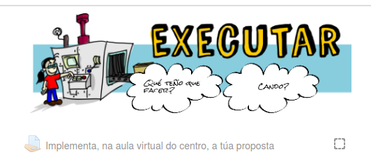

# tinG.li 听力

tinG.li puede significar "Ting.li is not Genial.ly". Es una librería javascript para crear etiquetas interactivas que puedes insertar en tus páginas web o LMS como Moodle.

## Uso en Moodle (creando una etiqueta):

1. Abre una etiqueta para editar y añade todas las imágenes y sonidas que vayas a necesitar.

2. Habilita el código HTML. 

3. Inserta un elemento canvas y ponle un nombre. Si quieres usar varios canvas ponles nombres diferentes. Por ejemplo:
   
`<p><canvas id="mycanvas"> Sorry. Your browser does not support HTML5 canvas element. </canvas></p>`

3. Haz una llamada a la función tingli. Necesita como mínimo 11 argumentos para funcionar. Los dos primeros definen el fondo, después, en grupos de nueve puedes definir cualquier número de elementos interactivos. Los argumentos son:

Argumento | Uso
---------|--------
 (fondo)|
 *imagen de fondo* | Copia el link de la correspondiente imagen que añadiste en el paso 1.
 *proporción vertical* | La etiqueta siempre va a usar todo el ancho permitido, en este argumento especificas la altura. Por ejemplo, si es un cuadrado perfecto, la altura será 1. Si es la mitad del ancho, la algura será 0.5.
 (primer elemento)|
 *posición horizontal* | Esta es la proporción del ancho. 0.5, y estará en el centro. Si escribes 0.25 estará a un cuarto del borde izquierdo. 0.75 y estará a un cuarto del borde derecho.
 *posición vertical* | Igual que la horizontal
 *ancho* | Como proporción del ancho total. 0.5 será la midad del tamaño total, y así sucesivamente.
 *altura* | Lo mismo para la altura.
 *mensaje* | Lo que pongas aquí se mostrará como un mensaje cuando hagas click en el elmento.
 *imagen* | La imagen para este elemento. Copia el enlace de la imagen correspondiente que pusiste en el paso 1.
 *enlace* | URL para ir cuando se haga click en el elemento. Esto solo funcionará si dejas el mensaje vacío.
 *audio* | audio para reproducir cuando se hace click. Copia aquí el enlace del archivo que adjuntaste en el paso 1. Esto sólo funcionará si dejas vacíos el mensaje y el enlace. 
 *vídeo*| vídeo para reproducir cuando hagas click. Inserta aquí un enlace de youtube. Esto sólo funcionará si dejas el mensaje, el enlace y el audio vacíos.
(segundo y siguientes elementos) |
Repito lo que hiciste para el primer elemento |

Ejemplo:
```
<script type="text/javascript">// <![CDATA[
tingli("mycanvas", 

                       "background.png",
                       0.4,
                       0.3, 
                       0.5,
                       0.3, 
                       0.5, 
                       "This message will display when you click on the first element. Pechar[X]",
                       "firstelement.png", 
                       "", 
                       "", 
                       "", 
                      0.60, 
                      0.5, 
                      0.3, 
                      0.5, 
                      "This message will display when you click on the second element. Pechar[X]", 
                      "secondelement.png", 
                      "",
                      "",
                      "");
                      
// ]]></script>`
```
Con esta función añadimos dos elementos Ambos muestran un mensaje cuando se pinchan. El primero se muestra al 30% horizontal y 50% vertical, con un ancho del 30% y una algura del 50%. El segundo se coloca al 60% horizontal, 50% vertical, ancho de 30% y alto de 50%. Así es como lo verías:




4. Si la librería no está instalada para todo el sistema añadiédolo en las "headers" en la administración del sitio, tienes que incluír el código. Sólo necesitas hacer esto una vez en cada página. Por ejemplo, si quieres hacer unas etiquetas para los temas del curso, sólo tienes que añadir el código en una de ellas.

Ejemplo:
```
<script type="text/javascript">// <![CDATA[

tingli("mycanvas", 
                       "background.png",
                       0.4,
                       0.3, 
                       0.5,
                       0.3, 
                       0.5, 
                       "This message will display when you click on the first element. Pechar[X]",
                       "firstelement.png", 
                       "", 
                       "", 
                       "", 
                      0.60, 
                      0.5, 
                      0.3, 
                      0.5, 
                      "This message will display when you click on the second element. Pechar[X]", 
                      "secondelement.png", 
                      "",
                      "",
                      "");
                      
      function tingli(){

      /*La función toma como argumentos los siguientes nombre del elemento canvas, imagen de fondo, altura, en relación al ancho,
      posición horizontal, en relación al tamaño disponible, posición vertical, en relación al tamaño disponible,
      ancho, en relación al tamaño disponible, alto, en relación al tamaño disponible,
      mensaje a mostrar, sólo funciona si no se introdujo ningún link, imagen a mostrar, enlace a un link,     
      enlace a un audio, sólo funciona si no se introdujo mensaje ni link
      enlace a un video,sólo funciona si no se introdujo mensaje, ni link, ni audio
      Estos últimos elementos se repiten para mostrar otros objetos

      Copyright 2020 David González Gándara
      This program is free software: you can redistribute it and/or modify
      it under the terms of the GNU General Public License as published by
      the Free Software Foundation, either version 3 of the License, or
      (at your option) any later version.

      This program is distributed in the hope that it will be useful,
      but WITHOUT ANY WARRANTY; without even the implied warranty of
      MERCHANTABILITY or FITNESS FOR A PARTICULAR PURPOSE.  See the
      GNU General Public License for more details.

      You should have received a copy of the GNU General Public License
      along with this program.  If not, see <https://www.gnu.org/licenses/>.
      */

        var img = new Image();
        img.src = arguments[1];
        var canvas = document.getElementById(arguments[0]);
        var ctx = canvas.getContext('2d');
        canvas.style.width = '100%';
        canvas.style.height = 600; //alto del canvas, ajustar segun a proporcion da imaxe

        canvas.width = canvas.offsetWidth; 
        canvas.heigth = canvas.offsetHeight;

        var objects=[];

        for(x=3;x<arguments.length;x+=9){
           var new_object = {topX:canvas.width*arguments[x] , 
                               topY:canvas.height*arguments[x+1], 
                               width: canvas.width*arguments[x+2], 
                               height:canvas.heigth*arguments[x+3], 
                               message:arguments[x+4], 
                               image:arguments[x+5],  
                               link:arguments[x+6], 
                               audio:arguments[x+7], 
                               video:arguments[x+8]}; 
           objects.push(new_object);
        }

        var strimg_pref = "objimg"+arguments[0];
        var straudio_pref = "objaudio"+arguments[0];
        var strdiv_pref = "objdiv"+arguments[0];

        for(var x=0;x<objects.length;x++){
          var strimg = strimg_pref+x;
          var straudio = straudio_pref+x;
          var strdiv = strdiv_pref+x;

          window[strimg] = new Image(); 
          window[strimg].src = objects[x].image;
          window[strdiv] = document.createElement("div");
          window[strdiv].style.position = "fixed";

          window[strimg].onload=function(){render();};

          window[strdiv].style.background = "white";
          window[strdiv].style.border = "solid black";  
          window[strdiv].style.color = "black";
          window[strdiv].innerHTML = objects[x].message;
          window[strdiv].style.display = "none"; 
          window[strdiv].style.borderRadius= "15px";
          window[strdiv].style.padding= "15px";
          window[strdiv].onclick=function(){this.style.display = 'none';};
          document.body.appendChild(window[strdiv]);

          if(objects[x].audio != ""){
            window[straudio] = new Audio();
            window[straudio].src = objects[x].audio;
          }
        }

        var highlighted = 100;

        render();

        document.getElementById(arguments[0]).addEventListener("click", function(){
            coords=canvas.relMouseCoords(event);

            for(var x=0;x<objects.length;x++){
              if(coords.x>objects[x].topX && coords.x<objects[x].topX+objects[x].width && coords.y>objects[x].topY && coords.y<objects[x].topY+objects[x].height)
                         {
                if(objects[x].link != "")
                   window.open(objects[x].link,"_blank");
                else if(objects[x].message != ""){
                   window[strdiv_pref+x].style.display="block";
                   window[strdiv_pref+x].style.left=event.pageX;
                   window[strdiv_pref+x].style.top="50%";
                   window[strdiv_pref+x].style.left="50%";
                   window[strdiv_pref+x].style.width="150px";
                }
                else if(objects[x].audio != ""){
                   window[straudio_pref+x].play();
                }
                else if(objects[x].video != ""){
                   window[strdiv_pref+x].style.display="block";
                   window[strdiv_pref+x].style.left=event.pageX;
                   window[strdiv_pref+x].style.top="10%";
                   window[strdiv_pref+x].style.left="10%";
                   window[strdiv_pref+x].style.width="600px";
                   window[strdiv_pref+x].style.height="400px";
   
                   window[strdiv_pref+x].innerHTML = "<iframe width='560' height='315' src='"+objects[x].video+"' frameborder='0' allow='accelerometer; autoplay; encrypted-media; gyroscope; picture-in-picture' allowfullscreen></iframe>";
                }
              }
            }
        }, false);
        document.getElementById(arguments[0]).addEventListener("mousemove", function(){
            coords=canvas.relMouseCoords(event);
            event.target.style.cursor = 'move';
            highlighted = 100;
            for(var x=0;x<objects.length;x++){
              if(coords.x>objects[x].topX && coords.x<objects[x].topX+objects[x].width && coords.y>objects[x].topY && coords.y<objects[x].topY+objects[x].height)
              {    
                highlighted = x;
                console.log("over area"+" "+x+", highlighted = "+highlighted);
                event.target.style.cursor = 'pointer';
              }           
            }
            render();
        }, false);
        function render(){
          ctx.clearRect(0, 0, canvas.width, canvas.height);
          ctx.drawImage(img, 0, 0, canvas.width, canvas.height);
          for(var x=0;x<objects.length;x++){
            if(highlighted==x){
              ctx.drawImage(window[strimg_pref+x], objects[x].topX-5,objects[x].topY-5,objects[x].width+10,objects[x].height+10);
            }
            else{
               ctx.drawImage(window[strimg_pref+x], objects[x].topX,objects[x].topY,objects[x].width,objects[x].height);
            }
          }           
        }
        function relMouseCoords(event){
         var totalOffsetX = 0;
         var totalOffsetY = 0;
         var canvasX = 0;
         var canvasY = 0;
         var currentElement = this;
         do{
          totalOffsetX += currentElement.offsetLeft - currentElement.scrollLeft;
          totalOffsetY += currentElement.offsetTop - currentElement.scrollTop;
         }
         while(currentElement = currentElement.offsetParent)
         canvasX = event.pageX - totalOffsetX;
         canvasY = event.pageY - totalOffsetY;
         return {x:canvasX, y:canvasY}
        }
   HTMLCanvasElement.prototype.relMouseCoords = relMouseCoords;
}

// ]]></script>
```
